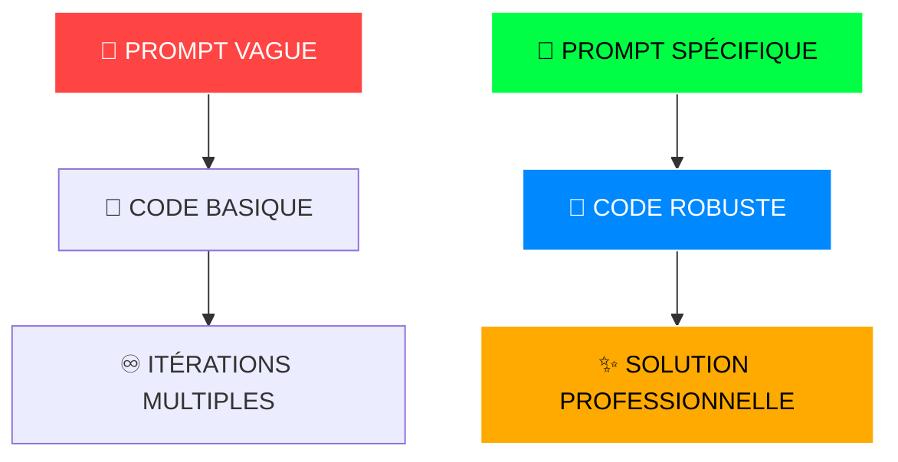

# 🌐 NEXUS-AI : SYSTÈME DE DÉVELOPPEMENT GÉNÉRATIF
## `SECTEUR 2077 • PROTOCOLE QUANTUM • CLASSIFICATION: OMEGA`

<div align="center">

```
██╗░█████╗░  ░██████╗░███████╗███╗░░██╗███████╗██████╗░░█████╗░████████╗██╗██╗░░░██╗███████╗
██║██╔══██╗  ██╔════╝░██╔════╝████╗░██║██╔════╝██╔══██╗██╔══██╗╚══██╔══╝██║██║░░░██║██╔════╝
██║███████║  ██║░░██╗░█████╗░░██╔██╗██║█████╗░░██████╔╝███████║░░░██║░░░██║╚██╗░██╔╝█████╗░░
██║██╔══██║  ██║░░╚██╗██╔══╝░░██║╚████║██╔══╝░░██╔══██╗██╔══██║░░░██║░░░██║░╚████╔╝░██╔══╝░░
██║██║░░██║  ╚██████╔╝███████╗██║░╚███║███████╗██║░░██║██║░░██║░░░██║░░░██║░░╚██╔╝░░███████╗
╚═╝╚═╝░░╚═╝  ░╚═════╝░╚══════╝╚═╝░░╚══╝╚══════╝╚═╝░░╚═╝╚═╝░░╚═╝░░░╚═╝░░░╚═╝░░░╚═╝░░░╚══════╝
```


```
▓▓▓▓▓▓▓▓▓▓▓▓▓▓▓▓▓▓▓▓▓▓▓▓▓▓▓▓▓▓▓▓▓▓▓▓▓▓▓▓▓▓▓▓▓▓▓▓▓▓▓▓▓▓▓▓▓▓▓▓▓▓▓▓▓▓▓▓▓▓
 CONNEXION ÉTABLIE • NIVEAU D'ACCÈS: DÉVELOPPEUR QUANTUM
▓▓▓▓▓▓▓▓▓▓▓▓▓▓▓▓▓▓▓▓▓▓▓▓▓▓▓▓▓▓▓▓▓▓▓▓▓▓▓▓▓▓▓▓▓▓▓▓▓▓▓▓▓▓▓▓▓▓▓▓▓▓▓▓▓▓▓▓▓▓
```

</div>

---

## ⚡ MATRICE DE NAVIGATION CYBERNÉTIQUE

```
┌─────────────────────────────────────────────────────────────────┐
│ 🎯 MODULE 1 : SÉLECTION ALGORITHMIQUE                          │
│ ⚡ MODULE 2 : GÉNÉRATION CODIQUE AUTOMATISÉE                    │
│ 🔧 MODULE 3 : OPTIMISATION & DÉBOGAGE NEURAL                   │
│ 🎓 SYNTHÈSE : CONVERGENCE DES SYSTÈMES                         │
└─────────────────────────────────────────────────────────────────┘
```

---

## 🎯 MODULE 1 : SÉLECTION ALGORITHMIQUE
### `PROTOCOLE DE CHOIX • INTELLIGENCE ARTIFICIELLE GÉNÉRATIVE`

<div align="center">

```
╔══════════════════════════════════════════════════════════════╗
║                    SOLUTION RETENUE                         ║
║            ▼ CHATGPT • MODÈLE GPT-OMEGA ▼                  ║
╚══════════════════════════════════════════════════════════════╝
```


</div>

**🧠 SPÉCIFICATIONS TECHNIQUES** : Entité d'intelligence artificielle développée par OpenAI. Système neural capable de traitement et génération linguistique avancée. Utilisé comme co-processeur de développement pour synthèse, correction et optimisation de code multi-langage.

### 🌟 AVANTAGES SYSTÈME

<div align="center">

```
┏━━━━━━━━━━━━━━━━━━━━━━━━━━━━━━━━━━━━━━━━━━━━━━━━━━━━━━━━━━━━━━━━━━┓
┃ 💬 MULTIFONCTIONNEL • Analyse, synthèse, optimisation        ┃
┃ 🌍 POLYGLOTTE • Support multi-langage (Python, JS, C++)      ┃
┃ ⏱️ ACCÉLÉRATION • Boost productivité x10                     ┃
┗━━━━━━━━━━━━━━━━━━━━━━━━━━━━━━━━━━━━━━━━━━━━━━━━━━━━━━━━━━━━━━━━━━┛
```

</div>

### ⚠️ LIMITATIONS DÉTECTÉES

<div align="center">

```
╔════════════════════════════════════════════════════════════════╗
║ ❌ PRÉCISION VARIABLE • Vérification humaine requise          ║
║ 📎 RISQUE DÉPENDANCE • Surveillance apprentissage nécessaire  ║
║ 🔒 ACCÈS RESTREINT • Interface limitée aux projets locaux     ║
╚════════════════════════════════════════════════════════════════╝
```

</div>

### 🎯 PROTOCOLES D'UTILISATION

```
▶ 🚀 GÉNÉRATION RAPIDE : Fonctions/algorithmes depuis description naturelle
▶ 🧪 DÉBOGAGE NEURAL : Analyse et correction de code complexe
▶ 📖 APPRENTISSAGE ACCÉLÉRÉ : Nouveaux langages et frameworks
▶ 📝 AUTO-DOCUMENTATION : Génération commentaires et tests unitaires
```

---

## ⚡ MODULE 2 : GÉNÉRATION CODIQUE AUTOMATISÉE
### `PROTOCOLE QUANTUM • ANALYSE COMPARATIVE MULTI-DIMENSIONNELLE`

### 📊 MATRICE D'ANALYSE COMPARATIVE

<div align="center">

```
╔══════════════════════════════════════════════════════════════════╗
║                    ANALYSE MULTI-VECTORIELLE                    ║
╚══════════════════════════════════════════════════════════════════╝
```

| **VECTEUR** | **CODE ALPHA** | **CODE BETA** | **CODE GAMMA** |
|:---:|:---:|:---:|:---:|
| 🏷️ **IDENTIFICATION** | `calculer` | `calculate` | `calculate` |
| 🌐 **LANGUE NATIVE** | Français | Mixte | Mixte |
| 🛡️ **NIVEAU SÉCURITÉ** | ⬛ Basique | ⬛⬛ Moyen | ⬛⬛⬛ Maximum |
| 📖 **CLARTÉ CODIQUE** | Simple | Structuré | Professionnel |
| 📏 **CONFORMITÉ PEP8** | ❌ Non | ⚠️ Partiel | ✅ Total |
| 🚨 **GESTION ERREURS** | Minimal | Amélioré | Complet |

</div>

### 🎯 PRINCIPE QUANTIQUE : LA SPÉCIFICITÉ

<div align="center">

```
██████████████████████████████████████████████████████████████████
 DÉCOUVERTE MAJEURE : L'impact maximal provient de la SPÉCIFICITÉ
██████████████████████████████████████████████████████████████████
```



</div>

### 💰 ANALYSE COÛT-EFFICACITÉ

<div align="center">

```
┏━━━━━━━━━━━━━━━━━━━━━━━━━━━━━━━━━━━━━━━━━━━━━━━━━━━━━━━━━━━━━━━━━━┓
┃ STRATÉGIE          │ RÉSULTAT INITIAL    │ EFFORT TOTAL        ┃
┣━━━━━━━━━━━━━━━━━━━━━━━━━━━━━━━━━━━━━━━━━━━━━━━━━━━━━━━━━━━━━━━━━━┫
┃ 🔄 PROMPT VAGUE    │ Fonctionnel basique │ ⚡ Faible + 🔄 ∞   ┃
┃ 🎯 PROMPT PRÉCIS   │ Robuste documenté   │ ⏰ Élevé - 🎯 Opt   ┃
┗━━━━━━━━━━━━━━━━━━━━━━━━━━━━━━━━━━━━━━━━━━━━━━━━━━━━━━━━━━━━━━━━━━┛
```

</div>

---

### 🎓 TECHNIQUE AVANCÉE : FEW-SHOT PROMPTING
#### `APPRENTISSAGE PAR EXEMPLES • PROTOCOLE NEURAL`

<div align="center">

```
╔══════════════════════════════════════════════════════════════════╗
║                  IMPACT DES EXEMPLES DÉTECTÉ                    ║
╚══════════════════════════════════════════════════════════════════╝
```

</div>

L'injection d'exemples a **SIGNIFICATIVEMENT AMPLIFIÉ** :

```
▶ 🎯 STRUCTURE PRÉCISE du format de sortie
▶ ⚠️ GESTION VALEURS INVALIDES (longueur, caractères)
▶ 🔄 COHÉRENCE dans la levée des erreurs
```

#### 🎪 PROTOCOLES D'ACTIVATION FEW-SHOT

<div align="center">

```
┌─────────────────────────────────────────────────────────────────┐
│ 📋 FORMATS ULTRA-PRÉCIS (codes produits, numéros série)        │
│ 🤔 RÈGLES MÉTIER IMPLICITES ou ambiguës                        │
│ 🚨 CAS LIMITES (ValueError, formats partiels)                  │
│ 📚 SCÉNARIOS MULTIPLES : bon/mauvais format, erreurs           │
└─────────────────────────────────────────────────────────────────┘
```

</div>

#### ⚖️ LIMITATIONS SYSTÉMIQUES

<div align="center">

```
██████████████████████████████████████████████████████████████████
⚠️ ALERTE SYSTÈME : DEUX LIMITATIONS MAJEURES DÉTECTÉES ⚠️
██████████████████████████████████████████████████████████████████
```

</div>

- **📉 QUALITÉ** : Exemple défaillant → Corruption de l'IA
- **📊 QUANTITÉ** : Surcharge d'exemples = confusion neural. **OPTIMAL : 2-3 exemples** > 6 similaires

---

## 🔧 MODULE 3 : OPTIMISATION & DÉBOGAGE NEURAL
### `SYSTÈME DE RÉPARATION AUTOMATISÉE • PROTOCOLE GAMMA`

### 🐛 ANALYSE D'ANOMALIE

<div align="center">

```
╔══════════════════════════════════════════════════════════════════╗
║                    🚨 ERREUR SYSTÈME DÉTECTÉE 🚨                ║
╚══════════════════════════════════════════════════════════════════╝
```

```python
# ❌ ANOMALIE IDENTIFIÉE
TypeError: unsupported operand type(s) for +=: 'int' and 'str'
```

</div>

**🔍 DIAGNOSTIC AUTOMATIQUE** :
```
▶ TYPE : TypeError • Classification: Critique
▶ LOCALISATION : Ligne `total += num`
▶ CAUSE RACINE : Fusion entier avec 'three' dans `[1, 2, 'three', 4]`
```

#### ✅ CORRECTIFS APPLIQUÉS

<div align="center">

```
┏━━━━━━━━━━━━━━━━━━━━━━━━━━━━━━━━━━━━━━━━━━━━━━━━━━━━━━━━━━━━━━━━━━┓
┃ 🔍 VALIDATION TYPES • Vérification avant calcul               ┃
┃ 🛡️ PROTECTION LISTES VIDES • Anti-DivisionByZero             ┃
┃ 💬 MESSAGES CONTEXTUALISÉS • Erreurs explicites               ┃
┃ 📚 DOCUMENTATION FONCTIONNELLE • Spécifications complètes     ┃
┗━━━━━━━━━━━━━━━━━━━━━━━━━━━━━━━━━━━━━━━━━━━━━━━━━━━━━━━━━━━━━━━━━━┛
```

</div>

#### 🧪 SUITE DE TESTS QUANTIQUES (PYTEST)

<div align="center">

```
╔══════════════════════════════════════════════════════════════════╗
║                   COUVERTURE DE TESTS • 100%                    ║
╚══════════════════════════════════════════════════════════════════╝
```

</div>

**✅ CAS NOMINAUX**
```
▶ Listes homogènes (entiers/décimaux)
▶ Listes mixtes (entiers + décimaux)
▶ Singleton numérique
```

**❌ CAS D'ERREUR**
```
▶ Liste vide
▶ Éléments non numériques
▶ Valeurs None
```

**🚨 TESTS D'EXCEPTIONS**
```
▶ Vérification relèvement d'exceptions spécifiques
```

---

### 🧹 REFACTORING ASSISTÉ
#### `PROTOCOLE DE RESTRUCTURATION CODIQUE`

<div align="center">

```
╔══════════════════════════════════════════════════════════════════╗
║                  ANALYSE CODE INITIAL                           ║
╚══════════════════════════════════════════════════════════════════╝
```

| **PROBLÉMATIQUE** | **IMPACT SYSTÈME** | **NIVEAU PRIORITÉ** |
|:---:|:---:|:---:|
| Variables obscures | 📉 Lisibilité | 🔴 CRITIQUE |
| Code monolithique | 🔧 Maintenabilité | 🔴 CRITIQUE |
| Absence documentation | 📚 Compréhension | 🟡 ÉLEVÉ |
| Pas de validation | 🛡️ Robustesse | 🟡 ÉLEVÉ |

</div>

#### 🎯 PROMPT REFACTORING QUANTIQUE

<div align="center">

```
╔══════════════════════════════════════════════════════════════════╗
║              INSTRUCTIONS DE REFACTORING NEURAL                 ║
╚══════════════════════════════════════════════════════════════════╝
```

</div>

```markdown
REFACTORISATION SELON PROTOCOLES SUIVANTS :

✅ **PEP8** : Conformité totale (nommage, espaces, longueur ≤79)
✅ **DOCUMENTATION** : Docstrings complètes (paramètres, retour, exemples)
✅ **MODULARITÉ** : Découpage SRP (Single Responsibility Principle)
✅ **SÉMANTIQUE** : Renommage variables (array → a, index → i)
✅ **EXÉCUTION CONTRÔLÉE** : Bloc `if __name__ == '__main__':` modulaire
```

#### 🏆 RÉSULTATS POST-REFACTORING

<div align="center">

```
┏━━━━━━━━━━━━━━━━━━━━━━━━━━━━━━━━━━━━━━━━━━━━━━━━━━━━━━━━━━━━━━━━━━┓
┃ 🔧 ENCAPSULATION • Fonction nommée (`bubble_sort`)            ┃
┃ 📏 CONFORMITÉ PEP8 • Standards respectés                     ┃
┃ 📚 DOCSTRINGS • Documentation structurée                     ┃
┃ 🏷️ RENOMMAGE • Clarté améliorée (`array`, `index`)          ┃
┃ 📦 MODULARITÉ • Bloc `if __name__ == "__main__"`             ┃
┗━━━━━━━━━━━━━━━━━━━━━━━━━━━━━━━━━━━━━━━━━━━━━━━━━━━━━━━━━━━━━━━━━━┛
```

</div>

---

### 📚 DOCUMENTATION AUTOMATISÉE
#### `GÉNÉRATION INTELLIGENTE • FONCTION : get_user_permissions`

<div align="center">

```python
def get_user_permissions(user_id, system_context):
    """
    🧠 SYSTÈME DE PERMISSIONS DYNAMIQUES
    Attribution contextuelle selon rôle utilisateur
    """
```

</div>

**📥 PARAMÈTRES D'ENTRÉE**
```
▶ user_id (int|str) : Identifiant utilisateur système
▶ system_context (dict) : Dictionnaire des rôles système
```

**📤 RETOUR SYSTÈME**
```
▶ list : Permissions attribuées (ex: ['read', 'write'])
```

**💡 EXEMPLE D'EXÉCUTION**

```python
system_roles = {
    'admins': {101, 105},
    'editors': {202, 304}
}

permissions = get_user_permissions(101, system_roles)
# RÉSULTAT : ['read', 'write', 'delete', 'admin']
```

---

## 🎓 SYNTHÈSE : CONVERGENCE DES SYSTÈMES

<div align="center">

```
██████████████████████████████████████████████████████████████████
                    POINTS CLÉS SYSTÈME
██████████████████████████████████████████████████████████████████
```

</div>

<div align="center">

```
┏━━━━━━━━━━━━━━━━━━━━━━━━━━━━━━━━━━━━━━━━━━━━━━━━━━━━━━━━━━━━━━━━━━┓
┃ 🧠 PROMPT QUALITÉ                                             ┃
┃    Prompt précis, structuré → amélioration qualité code x10   ┃
┣━━━━━━━━━━━━━━━━━━━━━━━━━━━━━━━━━━━━━━━━━━━━━━━━━━━━━━━━━━━━━━━━━━┫
┃ 📌 FEW-SHOT PROMPTING                                         ┃
┃    Exemples → généralisation IA + gestion cas limites         ┃
┣━━━━━━━━━━━━━━━━━━━━━━━━━━━━━━━━━━━━━━━━━━━━━━━━━━━━━━━━━━━━━━━━━━┫
┃ 🧰 AUGMENTATION VS REMPLACEMENT                               ┃
┃    IA augmente productivité ≠ remplace compréhension humaine  ┃
┣━━━━━━━━━━━━━━━━━━━━━━━━━━━━━━━━━━━━━━━━━━━━━━━━━━━━━━━━━━━━━━━━━━┫
┃ ✍️ QUALITÉ = FORMULATION                                      ┃
┃    Qualité résultat ∝ qualité formulation                     ┃
┗━━━━━━━━━━━━━━━━━━━━━━━━━━━━━━━━━━━━━━━━━━━━━━━━━━━━━━━━━━━━━━━━━━┛
```

</div>

<div align="center">

```
▓▓▓▓▓▓▓▓▓▓▓▓▓▓▓▓▓▓▓▓▓▓▓▓▓▓▓▓▓▓▓▓▓▓▓▓▓▓▓▓▓▓▓▓▓▓▓▓▓▓▓▓▓▓▓▓▓▓▓▓▓▓▓▓▓▓▓▓▓▓
 FIN DE TRANSMISSION • SYSTÈME NEXUS-AI • SECTEUR 2077
▓▓▓▓▓▓▓▓▓▓▓▓▓▓▓▓▓▓▓▓▓▓▓▓▓▓▓▓▓▓▓▓▓▓▓▓▓▓▓▓▓▓▓▓▓▓▓▓▓▓▓▓▓▓▓▓▓▓▓▓▓▓▓▓▓▓▓▓▓▓
```

</div>

---
