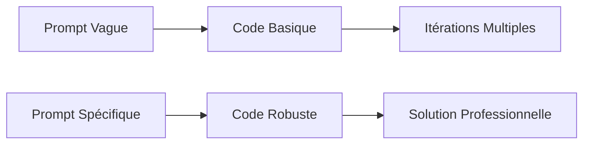

# 🤖 IA Générative pour le Développement
> Guide complet d'utilisation et d'optimisation des outils d'IA générative dans le développement logiciel

<div align="center">


</div>

---

## 📋 Table des Matières

- [🎯 Partie 1 : Choix de la Solution](#-partie-1--choix-de-la-solution)
- [⚡ Partie 2 : Génération de Code](#-partie-2--génération-de-code)
- [🔧 Partie 3 : Débogage et Amélioration](#-partie-3--débogage-et-amélioration)
- [🎓 Conclusion](#-conclusion)

---

## 🎯 Partie 1 : Choix de la Solution

### 🏆 Solution Retenue

<div align="center">

</div>

**ChatGPT (OpenAI)** - Modèle d'intelligence artificielle développé par OpenAI, capable de comprendre et de générer du langage naturel. Utilisé comme assistant de codage pour générer, corriger, expliquer ou améliorer du code dans plusieurs langages de programmation.

### ✨ Avantages

<table>
<tr>
<td align="center">💬</td>
<td><strong>Multifonctionnel</strong><br/>Peut expliquer du code, le commenter, le corriger ou générer de nouvelles fonctionnalités à partir d'une simple description</td>
</tr>
<tr>
<td align="center">🌍</td>
<td><strong>Polyglotte</strong><br/>Prend en charge une large variété de langages de programmation (Python, JavaScript, C, HTML, etc.)</td>
</tr>
<tr>
<td align="center">⏱️</td>
<td><strong>Gain de productivité</strong><br/>Permet d'accélérer le prototypage, la recherche d'erreurs ou l'exploration de solutions alternatives</td>
</tr>
</table>

### ⚠️ Limites et Inconvénients

<table>
<tr>
<td align="center">❌</td>
<td><strong>Précision variable</strong><br/>Peut générer du code incorrect ou inefficace, nécessitant une vérification attentive</td>
</tr>
<tr>
<td align="center">📎</td>
<td><strong>Risque de dépendance</strong><br/>Peut limiter l'apprentissage actif chez certains étudiants ou développeurs débutants</td>
</tr>
<tr>
<td align="center">🔒</td>
<td><strong>Accès limité</strong><br/>Pas d'accès direct au projet ou aux fichiers, contrairement à certains IDE intégrés</td>
</tr>
</table>

### 🎯 Cas d'Usage Typiques

- 🚀 **Génération rapide** de fonctions ou d'algorithmes à partir d'une description en langage naturel
- 🧪 **Débogage** ou explication de code complexe
- 📖 **Apprentissage** de nouveaux langages ou frameworks
- 📝 **Documentation** : génération de commentaires ou tests unitaires

---

## ⚡ Partie 2 : Génération de Code

### 📊 Exercice 2.1 : Analyse Comparative

<details>
<summary><strong>🔍 Cliquez pour voir l'analyse détaillée</strong></summary>

| **Aspect** | **Code 1** | **Code 2** | **Code 3** |
|:----------:|:----------:|:----------:|:----------:|
| **🏷️ Nom de fonction** | `calculer` | `calculate` | `calculate` |
| **🌐 Langue** | Français | Mixte | Mixte |
| **🛡️ Robustesse** | ⭐ Faible | ⭐⭐ Moyenne | ⭐⭐⭐ Élevée |
| **📖 Clarté** | Simple | Structuré | Professionnel |
| **📏 PEP8** | ❌ Non | ⚠️ Partiel | ✅ Respecté |
| **🚨 Gestion erreurs** | Basique | Améliorée | Complète |

</details>

### 🎯 Principe Clé : La Spécificité

> **💡 Insight Principal** : Le principe ayant le plus d'impact est **la spécificité** du prompt.

<div align="center">



</div>

### 💰 Coût Prompt : Vague vs Spécifique

| **Type de Prompt** | **Résultat** | **Effort Total** |
|:------------------:|:------------:|:----------------:|
| 🔄 **Vague** | Code fonctionnel mais basique | ⏰ Faible initial + 🔄 Itérations |
| 🎯 **Spécifique** | Code robuste et documenté | ⏰ Plus long initial - 🎯 Moins d'effort après |

---

### 🎓 Exercice 2.2 : Few-Shot Prompting

#### 📈 Impact des Exemples

L'ajout d'exemples a **significativement amélioré** :

<table>
<tr>
<td>🎯</td>
<td><strong>Structure précise</strong> du format de sortie</td>
</tr>
<tr>
<td>⚠️</td>
<td><strong>Gestion des valeurs invalides</strong> (longueur, caractères)</td>
</tr>
<tr>
<td>🔄</td>
<td><strong>Cohérence</strong> dans la levée des erreurs</td>
</tr>
</table>

#### 🎪 Quand utiliser le Few-Shot Prompting ?

- 📋 **Formats très précis** (codes produits, numéros de série)
- 🤔 **Règles métier implicites** ou ambiguës
- 🚨 **Cas limites** (ValueError, formats partiels)
- 📚 **Scénarios multiples** : bon/mauvais format, erreurs

#### ⚖️ Limites des Exemples

> **🚨 Attention** : Deux limites principales

- **📉 Qualité** : Un mauvais exemple peut induire l'IA en erreur
- **📊 Quantité** : Trop d'exemples = confusion. **2-3 exemples bien choisis** > 6 similaires

---

## 🔧 Partie 3 : Débogage et Amélioration

### 🐛 Exercice 3.1 : Débogage Assisté

#### 🚨 Analyse d'Erreur

<div align="center">

```python
# ❌ Erreur identifiée
TypeError: unsupported operand type(s) for +=: 'int' and 'str'
```

</div>

**🔍 Diagnostic** :
- **Type** : TypeError
- **Localisation** : Ligne `total += num`
- **Cause** : Sommation d'un entier avec 'three' dans `[1, 2, 'three', 4]`

#### ✅ Correctifs Appliqués

<table>
<tr>
<td>🔍</td>
<td><strong>Validation des types</strong> avant calcul</td>
</tr>
<tr>
<td>🛡️</td>
<td><strong>Gestion listes vides</strong> (évitement DivisionByZero)</td>
</tr>
<tr>
<td>💬</td>
<td><strong>Messages d'erreur contextualisés</strong></td>
</tr>
<tr>
<td>📚</td>
<td><strong>Documentation fonctionnelle</strong> ajoutée</td>
</tr>
</table>

#### 🧪 Tests Unitaires avec Pytest

<details>
<summary><strong>📋 Voir la couverture de tests</strong></summary>

**✅ Cas Nominaux**
- Listes homogènes (entiers/décimaux)
- Listes mixtes (entiers + décimaux)
- Singleton numérique

**❌ Cas d'Erreur**
- Liste vide
- Éléments non numériques
- Valeurs None

**🚨 Tests d'Exceptions**
- Vérification du relèvement d'exceptions spécifiques

</details>

---

### 🧹 Exercice 3.2 : Refactoring Assisté

#### 📊 Analyse du Code Initial

<div align="center">

| **Problématique** | **Impact** | **Priorité** |
|:-----------------:|:----------:|:------------:|
| Variables obscures | 📉 Lisibilité | 🔴 Haute |
| Code monolithique | 🔧 Maintenabilité | 🔴 Haute |
| Absence documentation | 📚 Compréhension | 🟡 Moyenne |
| Pas de validation | 🛡️ Robustesse | 🟡 Moyenne |

</div>

#### 🎯 Prompt de Refactoring

```markdown
Refactorisez ce code de tri en implémentant les bonnes pratiques suivantes :

✅ **PEP8** : Conformité stricte (nommage, espaces, longueur ≤79 caractères)
✅ **Documentation** : Docstrings complètes (paramètres, retour, exemples)
✅ **Modularité** : Découpage en fonctions SRP (Single Responsibility Principle)
✅ **Sémantique** : Renommage des variables (array au lieu de a, index au lieu de i)
✅ **Exécution contrôlée** : Bloc `if __name__ == '__main__':` pour usage modulaire
```

#### 🏆 Résultats du Refactoring

<table>
<tr>
<td>🔧</td>
<td>Encapsulation dans une fonction nommée (<code>bubble_sort</code>)</td>
</tr>
<tr>
<td>📏</td>
<td>Respect des conventions <strong>PEP8</strong></td>
</tr>
<tr>
<td>📚</td>
<td>Introduction de <strong>docstrings</strong> structurées</td>
</tr>
<tr>
<td>🏷️</td>
<td>Renommage pour améliorer la clarté (<code>array</code>, <code>index</code>)</td>
</tr>
<tr>
<td>📦</td>
<td>Ajout du bloc <code>if __name__ == "__main__":</code></td>
</tr>
</table>

---

### 📚 Exercice 3.3 : Documentation Automatisée

#### 🧠 Fonction Générée : `get_user_permissions`

<div align="center">

```python
def get_user_permissions(user_id, system_context):
    """
    Détermine dynamiquement les permissions d'un utilisateur
    selon son rôle dans le contexte système.
    """
```

</div>

**📥 Paramètres**
- `user_id` *(int|str)* : Identifiant utilisateur
- `system_context` *(dict)* : Dictionnaire des rôles système

**📤 Retour**
- `list` : Permissions attribuées (ex: `['read', 'write']`)

**💡 Exemple d'utilisation**

```python
system_roles = {
    'admins': {101, 105},
    'editors': {202, 304}
}

permissions = get_user_permissions(101, system_roles)
# Résultat : ['read', 'write', 'delete', 'admin']
```

---

## 🎓 Conclusion

<div align="center">

### 🔑 Points Clés Retenir

</div>

<table>
<tr>
<td align="center">🧠</td>
<td><strong>Prompt de qualité</strong><br/>Un prompt précis, structuré et contextuel améliore considérablement la qualité du code généré</td>
</tr>
<tr>
<td align="center">📌</td>
<td><strong>Few-Shot Prompting</strong><br/>L'ajout d'exemples permet à l'IA de mieux généraliser et gérer les cas limites</td>
</tr>
<tr>
<td align="center">🧰</td>
<td><strong>Augmentation, pas remplacement</strong><br/>L'IA augmente la productivité mais ne remplace pas la compréhension humaine</td>
</tr>
<tr>
<td align="center">✍️</td>
<td><strong>Qualité = Formulation</strong><br/>La qualité du résultat dépend directement de la qualité de la formulation</td>
</tr>
</table>

---

<div align="center">

### 🚀 Prêt à Optimiser Votre Workflow de Développement ?

**Mettez en pratique ces techniques pour maximiser l'efficacité de l'IA générative dans vos projets !**

---

*Réalisé avec ❤️ pour la communauté des développeurs*

</div>
